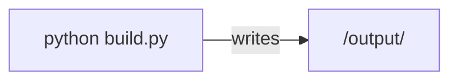
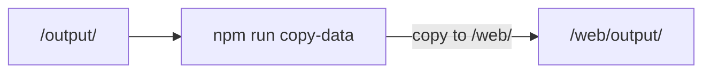

# Tech overview

This program consists of a Python codebase and a JavaScript codebase:

* [p33py](../p33py/): Python package for processing data to generate visualizations and JSON
* [web](../web/): website which takes visualizations and JSON as input and outputs the website as static HTML.

See [p33py/README.md](../p33py/README.md) and [web/README.md](../web/README.md) for more info.

## Toolchain

* [Plotly for Python] and [Plotly.js]
* [Jupyter] for working with visualizations
* [SvelteKit] web framework
* [TailwindCSS] CSS framework
* [Svelte inspector] to find sourcecode for DOM elements
* [Tota11y] to check accessibility
* [Playwright] browser functional testing
* [Gitpod] cloud IDE
* [Github Pages] hosting
* [Github Actions] pipeline
* [Cloudflare] edge CDN, security
* Commit hooks for linting: [pre-commit], [Black], [Prettier], and [eslint]

See [requirements.txt](../requirements.txt), [package.json](../web/package.json) for details, [.gitpod.yml](../.gitpod.yml), [githooks/](../githooks/), and [.github/workflows](../.github/workflows/).

## Pipeline

When code changes are pushed, a [build pipeline] runs automatically on Github.

The first step of the pipeline generates visualizations and JSON data:

The second step takes the output from the first step and compiles the website:

[build pipeline]: ../.github/workflows/build-and-deploy.yml
[Plotly for Python]: https://plotly.com/python/
[Plotly.js]: https://plotly.com/javascript/
[Jupyter]: https://jupyter.org/
[SvelteKit]: https://kit.svelte.dev/
[TailwindCSS]: https://tailwindcss.com/
[Svelte inspector]: https://joyofcode.xyz/svelte-inspector
[Tota11y]: https://khan.github.io/tota11y/
[Playwright]: https://playwright.dev/
[Gitpod]: https://gitpod.io/
[Github Pages]: https://pages.github.com/
[Github Actions]: https://github.com/features/actions
[Cloudflare]: https://www.cloudflare.com/
[pre-commit]: https://pre-commit.com/
[Black]: https://github.com/psf/black
[Prettier]: https://prettier.io/
[eslint]: https://eslint.org/
